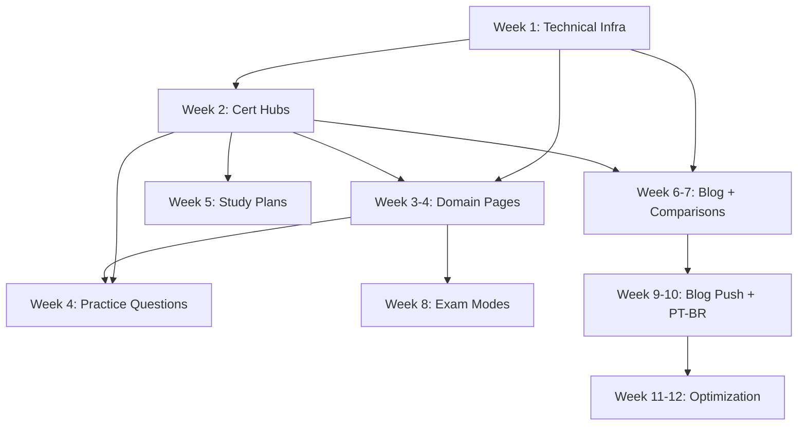

# SEO Content Calendar — 90-Day Execution Plan

> Status: DRAFT
> Date: 2026-02-12
> Role: Head of Growth
> Dependency: `seo-strategy.md`, `seo-site-architecture.md`, `seo-page-templates.md`
> Audience: Solo founder executing all content

---

## 1. Velocity Targets

| Milestone | Indexed Pages | Organic Sessions/mo | Signups |
|-----------|---------------|---------------------|---------|
| Day 30 | 40-60 | 200-500 | 10-25 |
| Day 60 | 70-90 | 1K-2.5K | 40-80 |
| Day 90 | 90-120 | 2K-5K | 100-250 |

---

## 2. Content Types & Effort Matrix

| Type | Effort (hrs) | How | Pages | Priority |
|------|--------------|-----|-------|----------|
| Technical SEO infra | 4-8 | Code | 3 files | P0 — Week 1 |
| Landing page SSR fix | 4-6 | Code | 1 page | P0 — Week 1 |
| Cert hub (programmatic) | 2-3 each | Code + content seed | 5 pages | P0 — Week 1-2 |
| Domain page (programmatic) | 1-2 each | Code + content seed | 33 pages | P1 — Week 2-4 |
| Practice question page | 3-4 each | Code + curate Qs | 5 pages | P1 — Week 3-4 |
| Study plan guide | 3-5 each | Write | 5 pages | P2 — Week 4-6 |
| Blog post | 3-5 each | Write | 15 posts | P2 — Ongoing |
| Comparison page | 4-6 each | Research + write | 6 pages | P2 — Week 5-8 |
| Exam mode explainer | 1-2 each | Write | 4 pages | P3 — Week 7-8 |

**Total estimated effort: 160-250 hours over 90 days (~2-3 hrs/day)**

---

## 3. Phase 1: Foundation (Days 1-30)

### Week 1 — Technical SEO Infrastructure

**Goal: Get Googlebot crawling and indexing correctly.**

| Day | Task | Type | Output |
|-----|------|------|--------|
| 1 | Create `src/app/robots.ts` | Code | robots.txt served at `/robots.txt` |
| 1 | Create `src/app/sitemap.ts` (basic) | Code | sitemap.xml with landing + cert hubs |
| 1 | Add `metadataBase` to root layout | Code | All metadata resolves correctly |
| 1 | Add OG tags + Twitter card to root layout | Code | Social sharing works |
| 2 | Add hreflang / alternates to root layout | Code | Google knows about EN + PT-BR |
| 2 | Add `noindex` to auth-gated layouts | Code | Dashboard/exams/etc not indexed |
| 2 | Create `(seo)` route group with layout | Code | Public page shell exists |
| 3 | Fix landing page: extract SSR content | Code | Core landing text is server-rendered |
| 3 | Add structured data (Organization) to root | Code | JSON-LD in every page |
| 4 | Create `src/lib/seo-data.ts` slug registry | Code | All cert/domain slugs defined |
| 4 | Create shared components: Breadcrumbs, SeoJsonLd | Code | Reusable across all SEO pages |
| 5 | Submit sitemap to Google Search Console | Config | Google starts crawling |
| 5 | Submit sitemap to Bing Webmaster Tools | Config | Bing starts crawling |
| 5 | Verify site in Google Search Console | Config | GSC access for monitoring |

**Week 1 deliverables:** 3 infra files, components, SSR fix, GSC setup. **~20-25 hours.**

### Week 2 — Cert Hub Pages (5 pages)

**Goal: 5 high-authority hub pages live and indexed.**

| Day | Task | Type | Output |
|-----|------|------|--------|
| 8 | Build cert hub template (`[cert]/page.tsx`) | Code | Dynamic route working |
| 8 | Add `generateStaticParams` for 5 certs | Code | Static generation at build |
| 9 | Write CISSP hub content (1,500 words) | Content | `/en/cissp/` live |
| 9 | Add CISSP FAQ items (6 questions) | Content | FAQPage schema |
| 10 | Write CC hub content (1,200 words) | Content | `/en/cc/` live |
| 10 | Write SSCP hub content (1,200 words) | Content | `/en/sscp/` live |
| 11 | Write CCSP hub content (1,200 words) | Content | `/en/ccsp/` live |
| 11 | Write CGRC hub content (1,200 words) | Content | `/en/cgrc/` live |
| 12 | Add FAQ items for CC, SSCP, CCSP, CGRC | Content | All hubs have FAQPage schema |
| 12 | Update sitemap with cert hub URLs | Code | 5 new URLs in sitemap |
| 12 | Add cert cross-links in footer | Code | All hubs interlinked |

**Week 2 deliverables:** 5 cert hub pages, ~6,000 words. **~15-18 hours.**

### Week 3 — Domain Pages Batch 1 (CISSP 8 + CC 5 = 13 pages)

**Goal: High-value domain pages for the two most-searched certs.**

| Day | Task | Type | Output |
|-----|------|------|--------|
| 15 | Build domain page template (`[cert]/[domain]/page.tsx`) | Code | Dynamic route working |
| 15 | Add `generateStaticParams` for all 33 domains | Code | Static paths defined |
| 15 | Create DomainNav component (prev/next) | Code | Navigation between domains |
| 16 | Write CISSP Domain 1 content (2,000 words) | Content | Highest-traffic domain page |
| 16 | Write CISSP Domain 2 content (1,800 words) | Content | |
| 17 | Write CISSP Domain 3 content (1,800 words) | Content | |
| 17 | Write CISSP Domain 4 content (1,800 words) | Content | |
| 18 | Write CISSP Domain 5 content (1,800 words) | Content | |
| 18 | Write CISSP Domain 6 content (1,500 words) | Content | |
| 19 | Write CISSP Domain 7 content (1,800 words) | Content | |
| 19 | Write CISSP Domain 8 content (1,500 words) | Content | |
| 20 | Write CC Domain 1-3 content (1,200 words each) | Content | |
| 21 | Write CC Domain 4-5 content (1,200 words each) | Content | |

**Week 3 deliverables:** 13 domain pages, ~20,000 words. **~25-30 hours.**

### Week 4 — Domain Pages Batch 2 + Practice Questions (20 + 2 pages)

| Day | Task | Type | Output |
|-----|------|------|--------|
| 22 | Write SSCP Domains 1-4 content (1,200 words each) | Content | 4 pages |
| 23 | Write SSCP Domains 5-7 content (1,200 words each) | Content | 3 pages |
| 23 | Write CCSP Domains 1-3 content (1,200 words each) | Content | 3 pages |
| 24 | Write CCSP Domains 4-6 content (1,200 words each) | Content | 3 pages |
| 24 | Write CGRC Domains 1-4 content (1,200 words each) | Content | 4 pages |
| 25 | Write CGRC Domains 5-7 content (1,200 words each) | Content | 3 pages |
| 26 | Build practice questions template | Code | Quiz client island working |
| 26 | Curate 10 CISSP practice questions | Content | `/en/cissp/practice-questions/` |
| 27 | Curate 10 CC practice questions | Content | `/en/cc/practice-questions/` |
| 28 | Update sitemap with all domain + practice URLs | Code | 55+ URLs in sitemap |

**Week 4 deliverables:** 20 domain pages + 2 practice question pages, ~25,000+ words. **~30-35 hours.**

### Phase 1 Summary

| Metric | Target | Status |
|--------|--------|--------|
| Pages published | 40-45 | Cert hubs (5) + Domains (33) + Practice (2) + Landing (1) + Infra (3) |
| Total words written | ~50,000 | Across all content pages |
| Technical SEO score | 90+/100 | robots, sitemap, metadata, structured data, hreflang |
| Google indexing | Submitted + crawling | GSC verified, sitemap submitted |

---

## 4. Phase 2: Content Expansion (Days 31-60)

### Week 5 — Practice Questions + Study Plans

| Day | Task | Type | Output |
|-----|------|------|--------|
| 29-30 | Curate 10 SSCP, CCSP, CGRC practice Qs each | Content | 3 more practice pages |
| 31-32 | Write CISSP study plan (3,000 words) | Content | `/en/cissp/study-plan/` |
| 33 | Write CC study plan (2,000 words) | Content | `/en/cc/study-plan/` |
| 34 | Write CISSP exam format / CAT explainer (1,500 words) | Content | `/en/cissp/exam-format/` |

**Deliverables:** 3 practice + 2 study plans + 1 exam format = 6 pages. **~20 hours.**

### Week 6-7 — Comparisons + Blog Launch

| Day | Task | Type | Output |
|-----|------|------|--------|
| 36 | Build comparison page template | Code | Route working |
| 36 | Build blog post template (MDX pipeline) | Code | MDX rendering working |
| 37-38 | Write: Boson vs ExamFlow (2,000 words) | Content | `/en/compare/boson-vs-examflow/` |
| 39-40 | Write: Pocket Prep vs ExamFlow (2,000 words) | Content | `/en/compare/pocket-prep-vs-examflow/` |
| 41-42 | Write: Best CISSP Practice Exams (2,500 words) | Content | `/en/compare/best-cissp-practice-exams/` |
| 43 | Write: cccure vs ExamFlow (1,500 words) | Content | `/en/compare/cccure-vs-examflow/` |
| 44-45 | Blog: "How to Pass CISSP First Time" (2,500 words) | Content | First blog post |
| 46-47 | Blog: "CISSP vs SSCP: Which Cert First?" (2,000 words) | Content | |
| 48 | Blog: "Top 10 CISSP Study Tips" (1,500 words) | Content | |

**Deliverables:** 4 comparisons + 3 blog posts = 7 pages. **~35 hours.**

### Week 8 — Exam Modes + More Blog

| Day | Task | Type | Output |
|-----|------|------|--------|
| 50 | Build exam modes template | Code | Route working |
| 50-51 | Write 4 exam mode explainers (1,000 words each) | Content | 4 exam mode pages |
| 52-53 | Blog: "3-Month CISSP Study Plan" (3,000 words) | Content | Cornerstone content |
| 54 | Blog: "CISSP CAT Format: What to Expect" (1,500 words) | Content | |
| 55 | Write SSCP, CCSP, CGRC study plans (2,000 words each) | Content | 3 study plan pages |

**Deliverables:** 4 exam modes + 2 blog posts + 3 study plans = 9 pages. **~25 hours.**

### Phase 2 Summary

| Metric | Target | Cumulative |
|--------|--------|------------|
| New pages | 22 | 62-67 total |
| Total words | ~35,000 new | ~85,000 cumulative |
| Blog posts live | 5 | 5 |
| Comparison pages | 4 | 4 |
| Practice question pages | 5 (all certs) | 5 |
| Study plans | 5 (all certs) | 5 |

---

## 5. Phase 3: Scale & Optimize (Days 61-90)

### Week 9-10 — Blog Content Push + PT-BR

| Day | Task | Type | Output |
|-----|------|------|--------|
| 57-58 | Blog: "Is CISSP Worth It in 2025?" (2,000 words) | Content | High-intent keyword |
| 59-60 | Blog: "CISSP Salary Guide" (2,000 words) | Content | Informational + high volume |
| 61-62 | Blog: "CC Certification Guide for Beginners" (2,000 words) | Content | CC pipeline |
| 63 | Blog: "How Many Questions on CISSP?" (1,000 words) | Content | Quick answer + long-tail |
| 64 | Blog: "CISSP Domain Weights and Study Allocation" (1,500 words) | Content | |
| 65-66 | Translate CISSP hub to PT-BR (1,500 words) | Content | `/pt-BR/cissp/` |
| 67 | Translate CC hub to PT-BR (1,200 words) | Content | `/pt-BR/cc/` |
| 68 | Translate landing page SEO content to PT-BR | Content | PT-BR landing optimized |
| 69 | PT-BR CISSP practice questions (10 Qs) | Content | `/pt-BR/cissp/practice-questions/` |
| 70 | PT-BR CC practice questions (10 Qs) | Content | `/pt-BR/cc/practice-questions/` |

**Deliverables:** 5 EN blog posts + 5 PT-BR pages = 10 new pages. **~30 hours.**

### Week 11-12 — Remaining Comparisons + Optimization

| Day | Task | Type | Output |
|-----|------|------|--------|
| 71-72 | Write: CISSP vs CCSP comparison (2,000 words) | Content | `/en/compare/cissp-vs-ccsp/` |
| 73-74 | Write: CC vs CISSP path comparison (2,000 words) | Content | `/en/compare/cc-vs-cissp/` |
| 75-76 | Blog: "Security+ vs CISSP" (2,000 words) | Content | Cross-certification |
| 77-78 | Blog: "CISSP Endorsement Process" (1,500 words) | Content | Post-exam content |
| 79-80 | Blog: "Free CISSP Practice Exams Ranked" (2,000 words) | Content | Lead magnet |
| 81 | Translate 3 top blog posts to PT-BR | Content | 3 PT-BR blog posts |
| 82-83 | Audit all pages: fix broken links, update meta | QA | All pages pass checklist |
| 84-85 | Optimize underperforming pages (based on GSC data) | Optimization | Improve titles, add sections |
| 86-87 | Add internal links to all new content | Optimization | Link graph complete |
| 88 | Update comparison data (prices, features) | Maintenance | Accurate comparisons |
| 89-90 | Compile 90-day performance report | Analysis | Metrics review doc |

**Deliverables:** 2 comparisons + 3 EN blog posts + 3 PT-BR pages + optimization pass = 8 new pages + quality improvements. **~30 hours.**

### Phase 3 Summary

| Metric | Target | Cumulative |
|--------|--------|------------|
| New pages | 18 | 80-90 total |
| Total words | ~25,000 new | ~110,000 cumulative |
| Blog posts | 8 more | 13 total EN + 3 PT-BR |
| PT-BR pages | 8 | 8 |
| All certs covered | ✅ | All 5 with hubs + domains + practice + study plans |

---

## 6. Page Inventory — Complete Day 90 List

### Programmatic (Generated from `seo-data.ts`)

| # | URL | Template | Status |
|---|-----|----------|--------|
| 1 | `/en/cissp/` | Cert Hub | Week 2 |
| 2 | `/en/cc/` | Cert Hub | Week 2 |
| 3 | `/en/sscp/` | Cert Hub | Week 2 |
| 4 | `/en/ccsp/` | Cert Hub | Week 2 |
| 5 | `/en/cgrc/` | Cert Hub | Week 2 |
| 6-13 | `/en/cissp/domain-[1-8]-*/` | Domain | Week 3 |
| 14-18 | `/en/cc/domain-[1-5]-*/` | Domain | Week 3 |
| 19-25 | `/en/sscp/domain-[1-7]-*/` | Domain | Week 4 |
| 26-31 | `/en/ccsp/domain-[1-6]-*/` | Domain | Week 4 |
| 32-38 | `/en/cgrc/domain-[1-7]-*/` | Domain | Week 4 |
| 39 | `/en/cissp/practice-questions/` | Practice | Week 4 |
| 40 | `/en/cc/practice-questions/` | Practice | Week 4 |
| 41 | `/en/sscp/practice-questions/` | Practice | Week 5 |
| 42 | `/en/ccsp/practice-questions/` | Practice | Week 5 |
| 43 | `/en/cgrc/practice-questions/` | Practice | Week 5 |

### Study Plans & Explainers

| # | URL | Template | Status |
|---|-----|----------|--------|
| 44 | `/en/cissp/study-plan/` | Study Plan | Week 5 |
| 45 | `/en/cc/study-plan/` | Study Plan | Week 5 |
| 46 | `/en/sscp/study-plan/` | Study Plan | Week 8 |
| 47 | `/en/ccsp/study-plan/` | Study Plan | Week 8 |
| 48 | `/en/cgrc/study-plan/` | Study Plan | Week 8 |
| 49 | `/en/cissp/exam-format/` | Exam Format | Week 5 |

### Comparisons

| # | URL | Template | Status |
|---|-----|----------|--------|
| 50 | `/en/compare/boson-vs-examflow/` | Comparison | Week 6-7 |
| 51 | `/en/compare/pocket-prep-vs-examflow/` | Comparison | Week 6-7 |
| 52 | `/en/compare/best-cissp-practice-exams/` | Comparison | Week 6-7 |
| 53 | `/en/compare/cccure-vs-examflow/` | Comparison | Week 6-7 |
| 54 | `/en/compare/cissp-vs-ccsp/` | Comparison | Week 11-12 |
| 55 | `/en/compare/cc-vs-cissp/` | Comparison | Week 11-12 |

### Blog Posts (EN)

| # | URL | Template | Status |
|---|-----|----------|--------|
| 56 | `/en/blog/how-to-pass-cissp-first-time/` | Blog | Week 6-7 |
| 57 | `/en/blog/cissp-vs-sscp-which-cert-first/` | Blog | Week 6-7 |
| 58 | `/en/blog/top-10-cissp-study-tips/` | Blog | Week 6-7 |
| 59 | `/en/blog/cissp-study-plan-3-months/` | Blog | Week 8 |
| 60 | `/en/blog/cissp-cat-format-what-to-expect/` | Blog | Week 8 |
| 61 | `/en/blog/is-cissp-worth-it-2025/` | Blog | Week 9-10 |
| 62 | `/en/blog/cissp-salary-guide/` | Blog | Week 9-10 |
| 63 | `/en/blog/cc-certification-guide-beginners/` | Blog | Week 9-10 |
| 64 | `/en/blog/how-many-questions-on-cissp/` | Blog | Week 9-10 |
| 65 | `/en/blog/cissp-domain-weights-study-allocation/` | Blog | Week 9-10 |
| 66 | `/en/blog/security-plus-vs-cissp/` | Blog | Week 11-12 |
| 67 | `/en/blog/cissp-endorsement-process/` | Blog | Week 11-12 |
| 68 | `/en/blog/free-cissp-practice-exams-ranked/` | Blog | Week 11-12 |

### Exam Mode Pages

| # | URL | Template | Status |
|---|-----|----------|--------|
| 69 | `/en/exam-modes/practice/` | Exam Mode | Week 8 |
| 70 | `/en/exam-modes/weak-domains/` | Exam Mode | Week 8 |
| 71 | `/en/exam-modes/spaced-review/` | Exam Mode | Week 8 |
| 72 | `/en/exam-modes/real-mix/` | Exam Mode | Week 8 |

### Portuguese (PT-BR)

| # | URL | Template | Status |
|---|-----|----------|--------|
| 73 | `/pt-BR/cissp/` | Cert Hub | Week 9-10 |
| 74 | `/pt-BR/cc/` | Cert Hub | Week 9-10 |
| 75 | `/pt-BR/` | Landing | Week 9-10 |
| 76 | `/pt-BR/cissp/practice-questions/` | Practice | Week 9-10 |
| 77 | `/pt-BR/cc/practice-questions/` | Practice | Week 9-10 |
| 78-80 | `/pt-BR/blog/*` (top 3 posts) | Blog | Week 11-12 |

**Grand total: ~80 pages by Day 90**

---

## 7. Content Production Workflow

### 7.1 Per-Page Process (Solo Founder)

```
1. Research (20 min)
   ├── Check target keyword in Google (what ranks?)
   ├── Note competitor content length & structure
   └── Gather facts from ISC2 official sources

2. Write (60-120 min)
   ├── Create MDX file or fill page data in seo-data.ts
   ├── Follow template wireframe from seo-page-templates.md
   └── Include internal links, CTAs, FAQ items

3. Technical (15 min)
   ├── Verify metadata renders correctly (dev server)
   ├── Check structured data in Rich Results Test
   └── Verify mobile layout

4. Publish (5 min)
   ├── git commit + push
   ├── Vercel deploys automatically
   └── Request indexing in GSC (if priority page)
```

### 7.2 Batching Strategy

- **Programmatic pages (domains):** Build the template once, then batch-write content for all 33 domains. Content writing is the bottleneck, not code.
- **Blog posts:** Write 2-3 per week, publish Mon/Wed/Fri.
- **Comparisons:** Research competitors on Sunday, write Mon-Tue.
- **PT-BR translations:** Batch translate 3-5 pages at once. Use AI-assisted translation, then manually review for accuracy.

### 7.3 AI-Assisted Content Guidelines

- **OK to use AI for:** First drafts of domain descriptions, FAQ generation, translation drafts, meta description variants.
- **Must be human-reviewed:** All published content. AI hallucinations on cert exam details are a credibility killer.
- **Never AI-only:** Comparison pages (require real product research), blog opinions, pricing claims.
- **Verify against ISC2 sources:** Domain names, exam weights, exam formats, pricing, prerequisites. ISC2 updates these periodically.

---

## 8. Content Dependencies



**Critical path:** Week 1 technical infra MUST be complete before any content pages are published. Without robots.txt, sitemap, and proper metadata, content won't be indexed correctly.

---

## 9. Weekly Time Budget (Solo Founder)

| Activity | Hours/Week | Notes |
|----------|-----------|-------|
| Content writing | 10-15 | Core time investment |
| Template/code development | 3-5 | Front-loaded in weeks 1-4 |
| SEO monitoring (GSC) | 1 | Weekly check-in |
| Link building / outreach | 0 | Skip for now — focus on content |
| Content optimization | 1-2 | Starts week 8+ |
| **Total** | **15-22** | ~2-3 hrs/day, sustainable pace |

---

## 10. Risk Mitigation

| Risk | Likelihood | Impact | Mitigation |
|------|-----------|--------|------------|
| Content burnout | High | High | Batch similar pages. Use AI for first drafts. |
| ISC2 updates exam format | Low | Medium | Monitor ISC2 news. Architecture allows easy updates. |
| Google doesn't index | Medium | High | Use GSC URL inspection. Fix crawl errors immediately. |
| Competitor copies content | Low | Low | Content + product integration is the moat. |
| Quality drops at volume | Medium | High | Follow checklist in seo-page-templates.md. |
| Domain content is too thin | Medium | Medium | Minimum 1,200 words per domain page. Expand top pages. |
